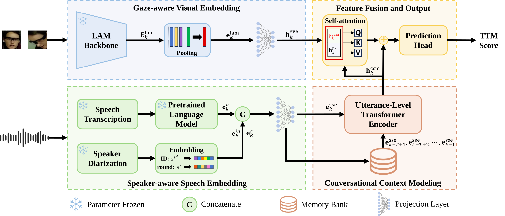

# Who is Talking to Me? Addressing Egocentric TTM with Speaker-aware Conversational Context (Interspeech 2026 Oral)


> [Fukun Chen](https://github.com/cfk1009), [Xionghu Zhong](xzhong@hnu.edu.cn), [Minjie Cai](https://cai-mj.github.io/) <br>
> Hunan University <br>
> Interspeech 2026 <br>
> [Paper Link](https://www.isca-archive.org/)

---
## 📢 News
* **[2026/10]** We presented our work at Interspeech 2026 as an oral presentation, and the code is now publicly available!
* **[2026/06]** Paper has been accepted by Interspeech 2026!
---

## 🗺️ Method Overview

Our multimodal conversational context framework consists of three main modules:
1. **Speaker-aware Speech Embedding (SSE)**: Combines textual semantics with fine-grained speaker identities and dialogue rounds.
2. **Conversational Context Modeling (CCM)**: Exploits long-range semantic dependencies of multi-round dialogues using an utterance-level Transformer encoder.
3. **Gaze-aware Visual Embedding (GVM)**: Captures looking-at-me cues to provide visual attention context.

 

---

## 💻 Code & Model Weights

### Repository tree

```text
EgoTTM/
├── src/egottm/          # inference library
├── scripts/             # inference and MemoryBank utilities
├── tests/               # unit tests
├── external/            # tokenizer/config, LAM code, and segment-indexed crops
├── final/
│   ├── weights/         # local model weights
│   └── transcripts/     # prepared inference CSV files
├── artifacts/           # ignored inference outputs
├── requirements.txt
└── README.md
```

### Model weights

Model weights and the validation face-crop archive are available in this
[shared Google Drive folder](https://drive.google.com/drive/folders/1pNrKuMIg4SO5YB_1ib2aquxX5xTgjs1Y?usp=sharing).

- Model weights: `ttm.pth`, `roberta.pth`, and `lam.pth`
- Validation face crops: compressed archive for `external/face_crops/`

After downloading, place the files in:

```text
final/weights/
├── ttm.pth
├── roberta.pth
└── lam.pth
```

Model weights and face crops are excluded from Git because of their size. After
downloading them from Google Drive, put the weights in `final/weights/`. Download
and extract the face-crop archive into `external/face_crops/`, preserving its
`{uid}/{segment_id}/` directory structure. The validation CSV keeps `gt_id` as
a reference and adds a per-`uid` `segment_id`; inference uses that segment ID to
find crops. Keep the tokenizer/config files under `external/roberta.large/`.
These paths are the defaults used by the inference command.

### Run inference

From the repository root, the standard local validation run is:

```bash
python scripts/infer.py --runtime-memory-bank
```

The command builds a temporary MemoryBank during inference and uses the local
defaults for the prepared CSV, checkpoints, tokenizer, face crops, output path,
and CUDA device. Override a path or use `--device cpu` when needed.

---

## 📖 Citation

If you find our work or code useful for your research, please consider citing our paper:

```bibtex
@inproceedings{chen2026who,
  title={Who is Talking to Me? Addressing Egocentric TTM with Speaker-aware Conversational Context},
  author={Chen, Fukun and Zhong, Xionghu and Cai, Minjie},
  booktitle={Proceedings of Interspeech},
  year={2026}
}
```
